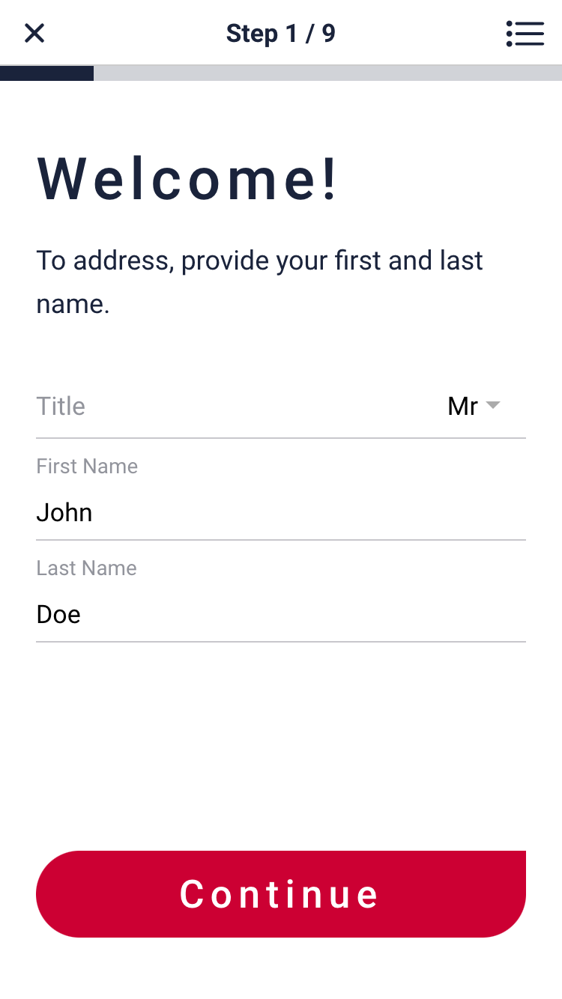

---

  

Currently, most of the job applications at job fairs are handled "manually" on paper. Digitact is an app that brings this whole process into the digital era.

Digitact is built with simplicity and good UX in mind. Almost all features are self-explanatory.

If you want to see more screenshots and read a more in-depth explanation of the features, please head over to the [feature documentation](https://github.com/Nasser-Eddin-Nasser/Digitact/blob/master/docs/features-frontend.md).

Want to build and try out Digitact yourself? Great! Please have a look at the [frontend README file](https://github.com/Nasser-Eddin-Nasser/Digitact/blob/master/frontend/README.md) and the [backend README file](https://github.com/Nasser-Eddin-Nasser/Digitact/blob/master/Backend/README.md).
