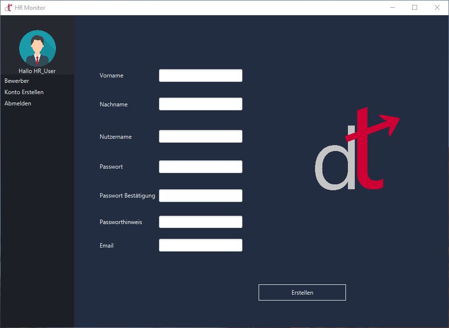
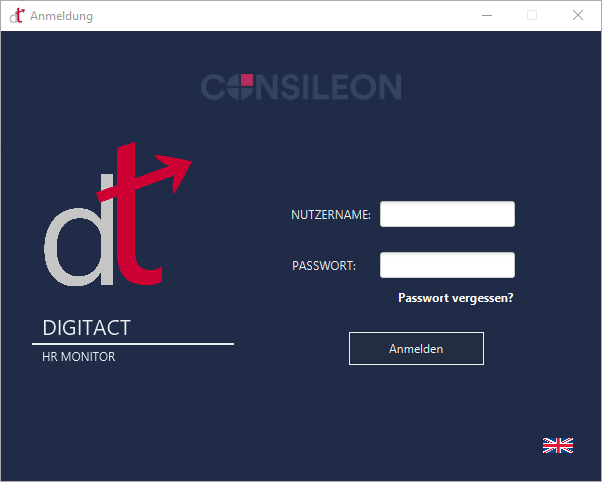
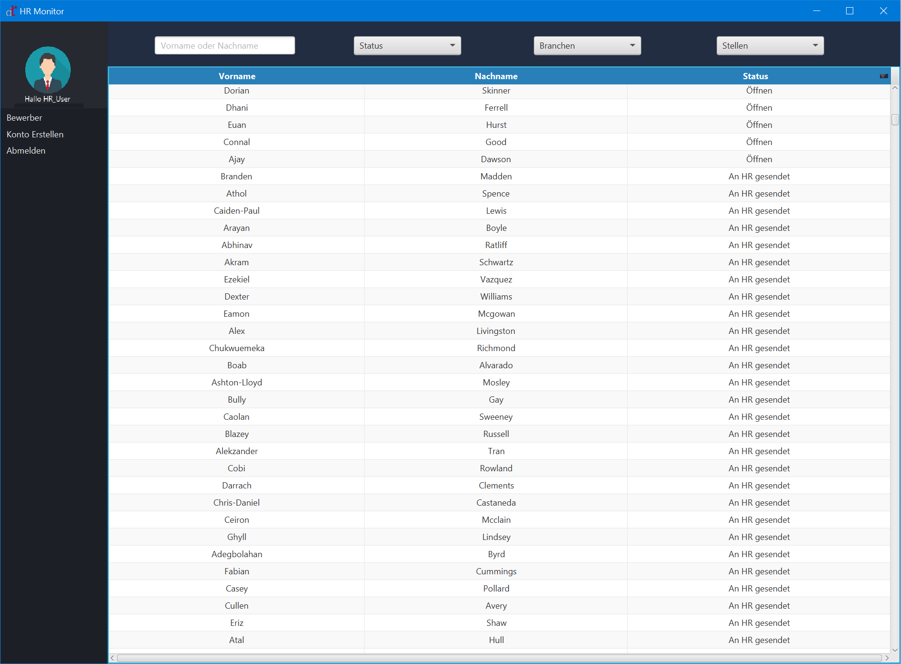
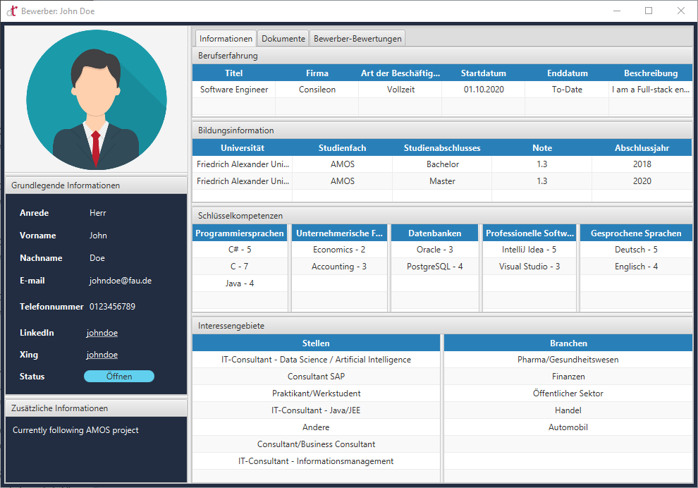
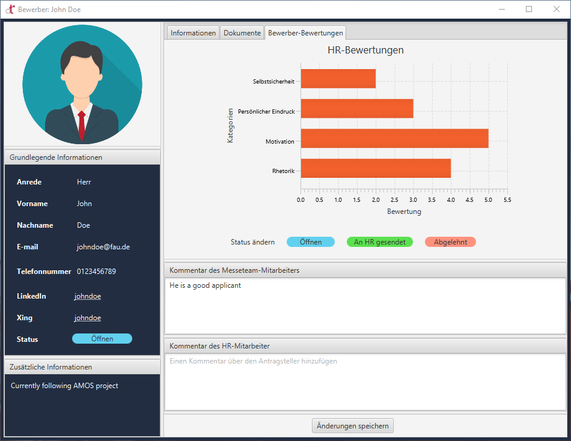

# HR-Monitor

HR-Monitor is a dekstop application where HR members can review and monitor the student applications collected during the job fair.

## Create Account Pane

The HR members can create user accounts here. The username should be unique to each HR person and filling all the fields are mandatory.

## Login Pane

Here, the HR member can log in to the account. 

He/she can select the language by simply clicking the flag button. The HR monitor has two language options: German and English.

## Overview Window  

This window consists of a table that shows all the list of applications. A user can filter out the applications with four filter options: Name(first name or last name or both), status, industries and positions. 

The table lists the applicant's first name, last name and status. To view the applicant's data in detail, the user has to double click an entry of the table.

There are three menu options on the left side of this window. The first option is "Applicants". This refreshes the list of applications (load all the applications from the database). The second option is "Create Account". The last is the "Log out" option.

## Applicant Information Window

This window shows all the details of the application filled by the applicant.

On the top left, you could see the profile picture of the applicant. Right below the profile picture, the Basic information and additional information are provided.

In the main viewing area of this window contains three tabs:
1. Information and preferences of the applicant.
2. Documents of the applicant, such as a CV.
3. Ratings and comments given by the fair team member.

### Information tab

The Information tab consists of four tables: 
1. Work experience  
2. Education information
3. Key competencies
4. Fields of interests

### Documents tab

This tab will have images of the documents, such as CV, transcript, Certificates etc. All the document images are zoomable and moveable. Therefore, HR member can have a closer look at the documents.  

### Applicant ratings tab

This tab consists of the following:
1. Applicant ratings given by the Fair team member. 
2. Status - Deault open and HR member can change the status after reviewing the application. 
3. Comment by the Fair team member(Read-only).
4. Comment by the HR member - This is an editable field where the user can add a comment and save the entry by clicking the "save changes" button.