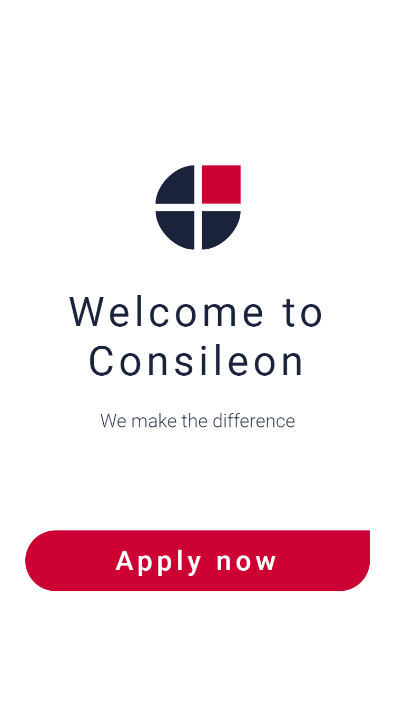
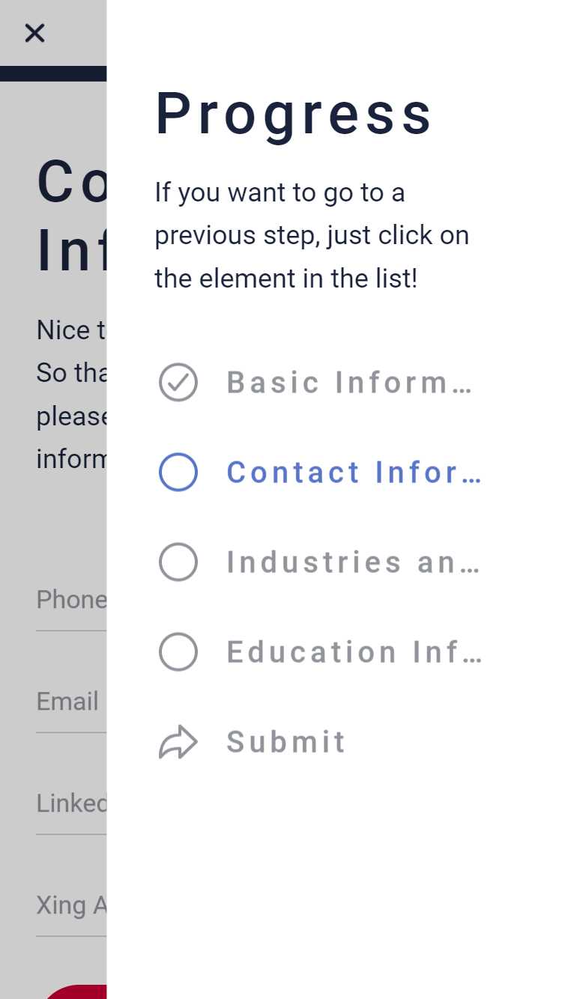

  

# Features

Currently, most of the job applications at job fairs are handled "manually" on paper. Digitact is an app that brings this whole process into the digital era.

Digitact is built with simplicity and good UX in mind. Almost all features are self-explanatory.

This is a quick overview of the most important features.

## Landing page

The landing page (also called "home page") is the very first screen the user sees when he opens the app. Here, right underneath the logo, a short headline related to the company is shown.

There is only one prominent button: "Apply now", which directly starts the job application process. 

## The application form

### "Welcome" Step

Once the user has pressed the "Apply now" button, he gets redirected to the actual job application form.

In the top bar, the number of the current "Step" is shown. Since we are showing the "Welcome" Step here (which is the very first one), it says "Step 1 / 4". On the right, a hamburger-esque menu icon is shown. Clicking on it will reveal an overview of the Steps (more about that later).

Directly underneath the top bar, there is a progress bar. Once you have filled out all required data of a particular Step, it will instantly move to the right. If the progress bar has reached the right border, it means that all Steps have successfully been filled out and the form may be submitted.

### Side menu

As already mentioned before, there is a menu on the right, which displays an overview of all the Steps. Once all required fields of a particular Step have been filled, a checkmark will appear for the respective menu item. This allows to quickly figure out where data is still missing. Clicking on a menu item allows to jump to this Step.

Also, the currently visible Step is highlighted in a different color. 

### "Contact Information" Step

In the second Step, the user shall enter contact information. This is especially useful to allow the HR agent to later contact the applicant.

### "Education Information" Step

The third step allows the user to provide details regarding the schools/universities he has visited. Once the user clicks on the "plus" icon, an overlay is displayed asking for the details. Once all fields have been entered and "Save" is clicked, this item will be added to the list on already added items. If one entry shall be deleted, this can be done using a swipe gesture.

### "Industries and Positions" Step

Of course, it is also really important to know which industries and positions the applicant is interested in. This is handled in the "Industries and Positions" step.

### Submit

Finally, the applicant reaches the "Submit" page. If there are still some fields missing in one of the previous Steps, he cannot submit the form. Instead, he is informed that the Side Menu will show where he still needs to enter some data. (As explained before, the progress bar also shows this kind of information: All necessary data have been filled in once the bar reaches the right border.)

### "Done" page

Once the form has been submitted, the applicant is informed that he is done and there is nothing left he needs to do.

The job application is now stored locally on the device. The HR team member may now click on "Quit" in order to go back to the home screen. Then, a new job application can be entered. Or, he may click on "Continue". This will show a screen where a rating of the applicant is possible. It is also possible to perform this rating later.

## Applicant rating page

The rating of the applicant is done using a similar UI as in the main job application form.

# HR-Monitor

## Create Account Pane

This pane can land in two instances:
1. Once you start the Backend server initially, the account creation pane appears for HR members to create the first HR-Monitor account. 
2. The HR member, who already has a user account in the HR-Monitor, can create a new account for another HR member. 

## Log-in Pane

This pane can land in two instances:
1. The HR-Monitor already has user accounts.
2. After the HR member creates the first HR account.

The HR member can enter the log-in details and access the HR-Monitor. Additionally, the user can select the preferred language of the HR-Monitor.  User can click the English or German flags to change the language. 

## Overview Window  

This window shows all the list of applicants in the HR-Monitor. A user can use filters to filter out the applicants. There are four filter inputs: Name(first name or last name), status, industries and positions. 

One table row corresponds to one application. The columns of the table are the applicant's first name, last name and the status of the application. If the HR member needs to check all the information about the applicant, the HR person can double click the corresponding row.

The left side pane consists of three buttons. The first button is named "Applicants". This button refreshes the list of applications (load all the applications from the database). The second button is "Create Account". The final and the third is the "Log out" button.

## Applicant Information Window

